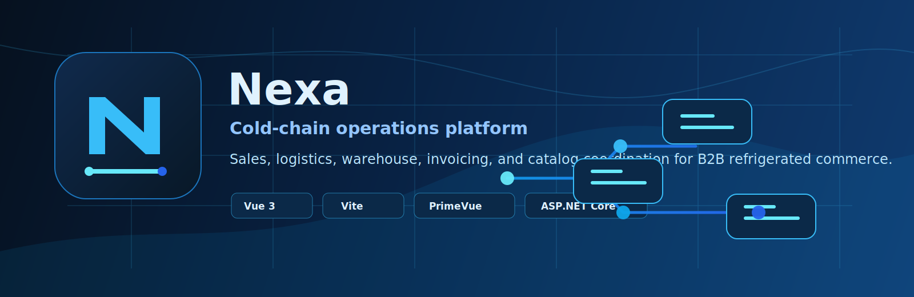
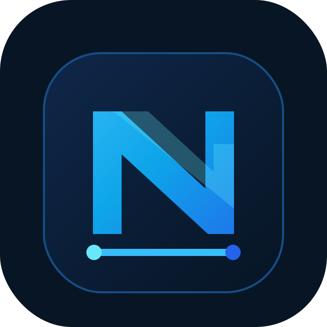
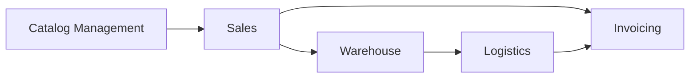

<p align="center">
  
</p>

<p align="center">
  <a href="https://github.com/upc-pre-202610-1asi0730-12242-king">
    
  </a>
  
  
</p>

<h1 align="center">Nexa</h1>

<p align="center">
  <strong>Cold-chain operations platform for coordinated B2B refrigerated commerce.</strong>
</p>

<p align="center">
  Nexa is an academic software project focused on helping teams coordinate sales, logistics,
  warehouse inventory, invoicing, and catalog operations in cold-chain business workflows.
</p>

<p align="center">
  
</p>

---

## Repository Map

<table>
  <tr>
    <td width="50%">
      <h3><a href="https://github.com/upc-pre-202610-1asi0730-12242-king/nexa-webapp">nexa-webapp</a></h3>
      <p>Frontend web application for operational workflows and user-facing platform screens.</p>
      <p>
        
        
        
      </p>
    </td>
    <td width="50%">
      <h3><a href="https://github.com/upc-pre-202610-1asi0730-12242-king/nexa-website">nexa-website</a></h3>
      <p>Public website and landing experience for presenting the Nexa product concept.</p>
      <p>
        
        
      </p>
    </td>
  </tr>
  <tr>
    <td width="50%">
      <h3><a href="https://github.com/upc-pre-202610-1asi0730-12242-king/nexa-platform">nexa-platform</a></h3>
      <p>Platform and backend work area for API, domain, and future infrastructure concerns.</p>
      <p>
        
        
      </p>
    </td>
    <td width="50%">
      <h3><a href="https://github.com/upc-pre-202610-1asi0730-12242-king/nexa-report">nexa-report</a></h3>
      <p>Academic report, product research, architecture documentation, and project evidence.</p>
      <p>
        
        
      </p>
    </td>
  </tr>
</table>

---

## Product Focus

Nexa explores how a B2B cold-chain team can align commercial decisions with inventory,
dispatch, and documentation workflows. The project emphasizes traceability, bounded contexts,
and a clean web interface for internal operations.

| Area | Project Focus |
| --- | --- |
| Sales | Order intake, commercial validation, customer requests, and sales coordination. |
| Logistics | Dispatch planning, delivery tracking, and operational visibility. |
| Warehouse | Inventory lots, stock movements, warehouse status, and cold-chain handling. |
| Invoicing | Business documents, invoicing support, and document status follow-up. |
| Catalog Management | Product catalog organization for refrigerated B2B commerce. |



---

## Technology Stack

| Layer | Technologies |
| --- | --- |
| Frontend | Vue 3, Vite, PrimeVue, JavaScript, HTML, CSS |
| Platform | ASP.NET Core as planned backend direction |
| Deployment | Firebase considered for future deployment |
| Documentation | Markdown, diagrams, academic report assets |
| Collaboration | GitHub repositories, pull requests, issue tracking |

<p>
  
  
  
  
  
</p>

---

## Engineering Workflow

| Practice | Purpose |
| --- | --- |
| GitFlow | Organize feature, release, and integration work across repositories. |
| Semantic Versioning | Communicate version intent clearly as the project evolves. |
| Conventional Commits | Keep commit history consistent and readable. |
| Pull Requests | Review changes before integration and document decisions. |
| Bounded Contexts | Keep business capabilities organized around domain concerns. |

Recommended commit style:

```text
feat(scope): add new capability
fix(scope): correct behavior
docs(scope): update documentation
refactor(scope): improve structure without changing behavior
```

---

## Academic Context

| Item | Detail |
| --- | --- |
| University | UPC |
| Course | Aplicaciones Web |
| Academic Cycle | 2026-10 |
| Team | Team King |
| Organization | `upc-pre-202610-1asi0730-12242-king` |

---

## Team

<table>
  <tr>
    <th align="left">Team</th>
    <th align="left">Focus</th>
  </tr>
  <tr>
    <td><strong>Team King</strong></td>
    <td>Nexa product design, web application development, platform planning, and academic documentation.</td>
  </tr>
</table>

---

<p align="center">
  <strong>Nexa</strong><br />
  Clean operational software for cold-chain coordination.
</p>
